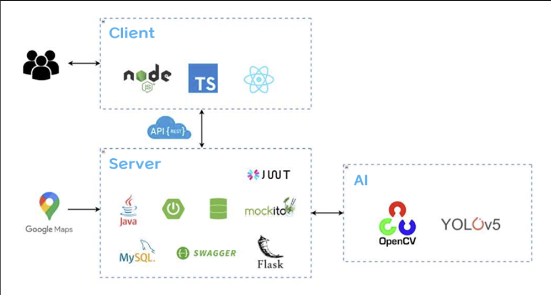

# ☕ SEATIFY - 스마트 카페 좌석 인식 및 혼잡도 시각화 시스템

 <!-- 적절한 이미지 삽입 필요 -->

**SEATIFY**는 실시간 AI 객체 인식을 기반으로 카페의 좌석 사용 여부와 혼잡도를 감지하고, 사용자에게 시각적으로 정보를 제공하는 **스마트 카페 좌석 서비스**입니다.

---

## 🧩 프로젝트 개요

> **"카페, 자리는 있을까?"**  
SEATIFY는 직접 방문하지 않아도 **빈 좌석**과 **혼잡도**를 실시간으로 확인할 수 있게 도와주는 시스템입니다.  
YOLOv5 기반 딥러닝 모델과 지도 연동 기능을 통해 사용자에게 편리한 **카페 선택 환경**을 제공합니다.

---

## 🔍 주요 기능

| 기능 항목                      | 설명 |
|-------------------------------|------|
| 🗺 지도 기반 카페 탐색        | 카카오맵 API 기반, 위치 주변 카페 탐색 |
| 🔴 실시간 좌석 혼잡도 확인    | 좌석별 점유 상태(Empty/Using/Step Out) 감지 |
| 📊 시간대별 혼잡도 예측       | 과거 데이터를 바탕으로 혼잡 시간대 추천 |
| 🎨 좌석 시각화                | 프론트 UI 상 좌표 기반 SVG 표시 |
| 💬 리뷰 및 커뮤니티 기능      | 사용자 리뷰 작성 및 정보 공유 |
| ✨ 타 카페 추천               | 현재보다 덜 혼잡하고 가까운 카페 추천 |

---

## 🧠 시스템 아키텍처

SEATIFY는 **Client – Server – AI** 구조로 구성되어 있습니다.

- **Client**: 카카오맵 기반 카페 탐색, 좌석 시각화
- **Server**: 좌석 정보 API 제공, DB 관리, AI 결과 연동
- **AI**: YOLOv5 모델로 실시간 감지 및 상태 추론



---

## ⚙️ 기술 스택

| 구분         | 기술 스택 |
|--------------|-----------|
| **프론트엔드** | React.js, TypeScript, MUI, Redux Toolkit |
| **백엔드**     | Java 17, Spring Boot, Spring Security, JWT, JPA |
| **데이터베이스** | MySQL, MariaDB, 복합 인덱스 튜닝 |
| **AI 모델**    | Python 3.9, YOLOv5, OpenCV, Flask, ArUco |
| **지도 API**   | Kakao Map API |
| **API 문서화** | Swagger |
| **테스트 도구**| JUnit, Mockito |
| **서버 통신**  | RESTful API, Axios |

---

## 📁 프로젝트 구성

 ```
seatify/
├── ai/ # YOLOv5 기반 객체 감지 및 상태 판단 (Python)
│ ├── detect1_core.py # 테이블 위치/형태 감지
│ ├── detect2_core.py # 좌석 상태 판단 (Empty, Using, Step-Out)
│ ├── detect3_core.py # 통합 감지 모델 (사람 + 물체)
│ ├── flask_server.py # Flask 기반 테스트 서버
│ └── calibration/ # ArUco 마커 기반 투시 변환 데이터
│
├── seatify-be/ # Spring Boot 백엔드 서버 (Java)
│ ├── controller/ # REST API 제공
│ ├── service/ # 비즈니스 로직 처리
│ ├── repository/ # JPA 기반 DB 연결
│ └── entity/ # 테이블 Entity 매핑
│
├── seatify-fe/ # React 기반 프론트엔드 (TypeScript)
│ ├── pages/ # 카페 탐색, 좌석 시각화 페이지
│ ├── components/ # 좌석 리스트, 지도 컴포넌트 등
│ └── api/ # 서버 통신용 Axios API 모듈
│
├── assets/ # 발표 자료 이미지, 시스템 아키텍처 등
│ └── architecture.png # 시스템 아키텍처 이미지
│
└── README.md # 프로젝트 소개 문서
 ```

## 👥 팀원 소개

| 이름     | 역할 설명 |
|----------|-----------|
| 🎨 **김소유** | React 기반 프론트엔드 UI/UX 설계<br>좌석 시각화 및 실시간 상태 반영<br>카카오맵 연동 및 사용자 인터페이스 구현 |
| 🖥 **박지호** | AI 모델 설계 및 구현<br>YOLO 성능 개선 및 경량화<br>데이터 수집 및 라벨링 |
| 🧠 **신형철** | API 연동 테스트<br>시각화 협업 지원<br>AI 라벨링 및 리뷰 피드백<br>Spring Boot 백엔드 설계 및 DB 최적화 |


## 🚀 How to Run

SEATIFY는 AI 감지 서버, Spring Boot 백엔드, React 프론트엔드로 구성되어 있으며, 아래 순서대로 실행하면 됩니다.

### ⚙️ 초기 설정 (최초 1회만)
```bash
1. Gradle 설정

IntelliJ에서 seatify-be 프로젝트를 열고, Gradle Wrapper로 프로젝트를 인식하도록 설정합니다.

2. JDK 및 가상환경 설정

seatify-be: JDK 17 이상 설정

seatify-ai: Python 가상환경 생성 및 활성화


python -m venv venv
source venv/bin/activate  # macOS/Linux
.\venv\Scripts\activate   # Windows

3. 환경 변수 파일 설정

.env.local 파일을 seatify-be 및 seatify-fe에 각각 생성하고 아래 내용을 입력

# 예시 (seatify-be)
DB_URL=jdbc:mysql://localhost:3306/seatify
DB_USERNAME=your_username
DB_PASSWORD=your_password
GOOGLE_CLIENT_ID=...
GOOGLE_CLIENT_SECRET=...
KAKAO_CLIENT_ID=...
JWT_SECRET=your_jwt_secret

# 예시 (seatify-fe)
REACT_APP_API_BASE_URL=http://localhost:8080

4. 프론트엔드 종속성 설치 (의존성 충돌 방지)

cd seatify/seatify-fe
npm install --legacy-peer-deps
 ``` 

### 1️⃣ AI 서버 실행 (Flask + YOLOv5)

```bash
# 가상환경 실행 (선택)
source venv/bin/activate  # macOS/Linux
# 또는
.\venv\Scripts\activate   # Windows

# ai 디렉토리로 이동 후 서버 실행
cd seatify-ai/src/main/ai
python flask_server.py
 ``` 


### 2️⃣ 백엔드 서버 실행 (Spring Boot)

 ```bash 
# seatify-be 디렉토리로 이동
cd seatify/seatify-be

# Gradle 빌드 및 실행
./gradlew bootRun  # macOS/Linux
# 또는
gradlew.bat bootRun  # Windows
 ``` 

### 3️⃣ 프론트엔드 실행 (React)

 ```bash 
# seatify-fe 디렉토리로 이동
cd seatify/seatify-fe

# 패키지 설치 및 실행
npm install
npm start
 ``` 

### 🔍 확인 방법

 ```bash
AI 감지 서버: http://localhost:5001

Spring Boot API: http://localhost:8080

React 프론트: http://localhost:3000
 ``` 
